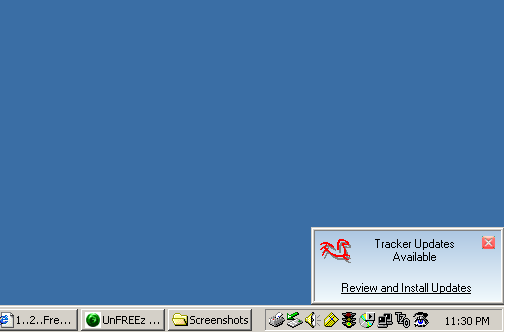



## ReVive LiveUpdate with Help File and Script Editor

### Description

LiveUpdate for all your apps in 4 easy steps! Provides complete program update functionality across both LAN&#8217;s and WAN&#8217;s. Comprehensive help file included. Updates up to 99 files, any type. Registers OCX and DLL files when permissions allow (aborts when they do not). Three run modes: Auto, Notify, and Normal. Two application shutdown options: automatic and via user warning. Optionally closes and re-opens your application if killed by ReVive or the user during update. Supports any combination of HTTP and FTP file downloads. Supports multiple client directory script constants and ready for more. Validates required user rights before downloading any update files. Performs comprehensive 6-point test on all update files before any are installed (virtually every failure possibility tested). MustUpdate and MustExist tags ensure file version compatibility during updates if critical file updates fail. Replaces in use files the way Microsoft says to (plus a clever and usually successful EXE addition). Generates and displays a complete before or after HTML update report on demand. Optionally informs client of updated file functionality details. One client ReVive installation supports any number of programs via file association or command line parameters. Complete per file and total download progress display (chose of 3 different formats). Supports primary and alternate web update script download locations. Reboots client computer when required (forced or optional). Client stored web update URL's are encrypted for security. Lists all update components by file description, with optional icon of file being updated. Includes an almost complete web update script editor with tag coloring, script testing, data type validation, entry automation, distributable file creation, and complete help system. Windows 98/NT 4.0 through XP tested and compatible. Complete with a help file, logic document, version info file, and resource file documentation &#8211; this is one of the most documented submissions on PSC, which was done hoping for good feedback. I would like to apply our collective experience and make this Live Update as bullet-proof as VB allows. Please comment/vote if you suggestions or find bugs, your feedback is appreciated.
 
### More Info
 

             |
---                |---
**Submitted On**   |2006-05-20 12:56:22
**By**             |[Bugzy](https://github.com/Planet-Source-Code/PSCIndex/blob/master/ByAuthor/bugzy.md)
**Level**          |Advanced
**User Rating**    |5.0 (352 globes from 71 users)
**Compatibility**  |VB 6\.0
**Category**       |[Complete Applications](https://github.com/Planet-Source-Code/PSCIndex/blob/master/ByCategory/complete-applications__1-27.md)
**World**          |[Visual Basic](https://github.com/Planet-Source-Code/PSCIndex/blob/master/ByWorld/visual-basic.md)
**Archive File**   |[ReVive\_Liv1995685202006\.zip](https://github.com/Planet-Source-Code/bugzy-revive-liveupdate-with-help-file-and-script-editor__1-62479/archive/master.zip)

